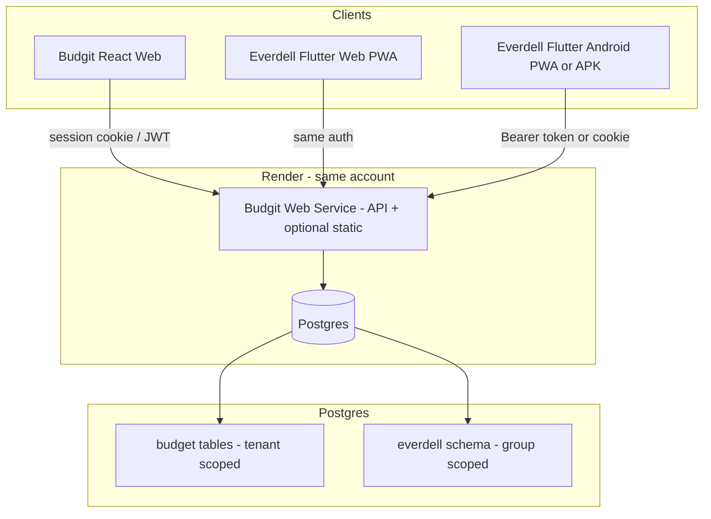

# Budgit + Everdell Tracker — Integration Plan

> **Purpose:** Handoff document for implementing Everdell Tracker inside the Budgit ecosystem (`budgit.lol`).  
> **Copy target:** Place this file in the Budgit repo root (or `docs/`) and use it to drive implementation.  
> **Everdell repo:** `everdell_tracker` (Flutter) remains the client UI; Budgit repo owns auth, API, DB, and hosting orchestration.

---

## Executive summary

- Users log into **budgit.lol**, open **Everdell Tracker** from the menu, and read/write a **shared scorebook** scoped by **Everdell group** (not Budgit tenant).
- John (budget tenant A) and Julia (budget tenant B, or no budget) can both belong to the same Everdell group and share game history.
- **Server is source of truth** — no persistent offline sync in v1; phone/web fetch live on open, write-through on save.
- **Keep Flutter** for the Everdell UI; extend the **Budgit backend** with Everdell API routes and Postgres tables (preferably in a separate `everdell` schema).
- **Render will not block this** — Hobby plan allows many services on one account. This is normal personal-project usage.

---

## Goals

| Goal | Notes |
|------|--------|
| Single login at budgit.lol | Reuse existing Budgit auth (session/JWT) |
| Menu navigation to Everdell | e.g. `/everdell` or subdomain |
| Shared scorebook for a circle of players | Group membership, not tenant_id |
| Multiple groups per user | Family group + friends group; UI switcher |
| iPhone usable now | Flutter web PWA; optional separate home-screen icon |
| Live data, minimal conflict | Server authoritative; UUID + `updated_at` + 409 on stale writes |
| No regression to Budgit budget | Everdell isolated in DB + code |

## Non-goals (v1)

- Offline-first sync / local DB replication on phone
- Per-user “budget vs everdell” permission matrix (budget is optional; Everdell uses group membership)
- App Store native binaries (PWA is sufficient for v1)
- Rebuilding Everdell in React

---

## Architecture



### Separation of concerns

| Layer | Budgit budget | Everdell Tracker |
|-------|---------------|------------------|
| Auth identity | `users.id` | Same `users.id` |
| Authorization | `tenant_id`, tenant membership | `everdell_group_id`, group membership |
| Data scope | Per tenant | Per Everdell group |
| Client | React | Flutter (existing app) |

**Critical rule:** Everdell API handlers must **never** authorize using `tenant_id` alone. Always: authenticated user → member of `group_id` → query rows for that `group_id`.

---

## Render — what will and will not “just work”

### Render is fine with this

- **Multiple services** on one Hobby account (static sites + web service + Postgres).
- **Extending one web service** with new API routes and DB tables — normal deploy.
- **Custom domains** — `budgit.lol`, `everdell.budgit.lol`, or path-based serving from one service.
- Render does **not** restrict “one personal app per account” or block adding modules.

### What does NOT happen automatically on `git push`

| Expectation | Reality |
|-------------|---------|
| “Render picks up new schema” | **No.** You must run migrations (deploy command, release phase, or manual). |
| “Same app, new URL slugs appear” | **Only if you configure routing** (see Hosting options below). |
| “Flutter builds inside Budgit deploy” | **Not by default.** Decide: build Flutter in CI and commit/copy `build/web`, or separate Render static service, or multi-step deploy script. |
| “Postgres alters itself” | **No.** Use migration tool (Prisma, Knex, Alembic, raw SQL migrations — match Budgit stack). |

### Free-tier operational notes

- Free **web services spin down** after ~15 min idle — first request may be slow (acceptable for personal use).
- **Postgres free** has storage/connection limits — fine for hobby; monitor size.
- **Build minutes / bandwidth** are shared across services on the account.

### Hosting options (pick one for v1)

#### Option A — Subdomain (recommended POC + v1)

| Piece | Config |
|-------|--------|
| Budgit | `budgit.lol` → existing web/static service |
| Everdell | `everdell.budgit.lol` → Render **Static Site** (Flutter `build/web`) OR static files served by Budgit |
| Auth cookies | Set cookie domain to `.budgit.lol` so both subdomains share session |
| Menu link | `<a href="https://everdell.budgit.lol">` or in-app router to external URL |

**Pros:** Simplest routing, isolated builds, low risk to Budgit deploy.  
**Cons:** Two services to deploy (still one Render account).

#### Option B — Path on same domain

| Piece | Config |
|-------|--------|
| Everdell | `budgit.lol/everdell/*` |
| Implementation | Budgit web server serves Flutter `build/web` as static files under `/everdell`, **or** Render static site rewrite rules pointing to a separate origin (more fragile) |

**Pros:** Single domain, single “app” feel.  
**Cons:** Flutter web expects correct `base href` (`/everdell/`); server must SPA-fallback `index.html` for deep links; more config errors.

#### Option C — Keep separate Render static site (current Everdell)

- Leave `everdell-tracker-web.onrender.com` as-is initially.
- Point API at `api.budgit.lol` or `budgit.lol/api`.
- Add Budgit login redirect; Flutter stores JWT.
- Migrate to `everdell.budgit.lol` when POC passes.

**Pros:** Zero change to Budgit deploy while proving API + auth.  
**Cons:** Third URL during transition.

### Recommended hosting path

1. **POC:** Option C or A with `everdell.budgit.lol` + API on existing Budgit service.  
2. **v1:** Option A (subdomain + shared cookie domain).  
3. **Optional later:** Option B if you want one domain only.

---

## Security model

### Threat model (personal / friends)

- Untrusted users must not read/write Everdell groups they are not in.
- Everdell must not expose Budgit financial data.
- Guessing UUIDs must not bypass membership checks.

### Implementation checklist

- [ ] Everdell tables in separate schema or clearly prefixed tables (`everdell_*`).
- [ ] No SQL joining budget tables in Everdell read paths unless intentional (e.g. display name).
- [ ] Middleware: `requireAuth` → `requireGroupMember(groupId)` on every Everdell route.
- [ ] Never trust client-supplied `group_id` without membership lookup.
- [ ] Return **404** (not 403) for non-member access to avoid leaking existence of IDs.
- [ ] Audit fields: `created_by`, `updated_by`, `updated_at` on mutable rows.
- [ ] Rate-limit group creation / invite redemption (basic abuse prevention).
- [ ] CORS: allow Everdell origin(s) only if using Bearer tokens cross-origin; prefer same-site cookies on `.budgit.lol`.

### Shared data across Budgit tenants

This is **intentional**, not a tenant leak:

- Budgit tenant isolation applies to **budget** data only.
- Everdell isolation is **group-scoped**.
- A user in two groups sees two separate scorebooks — not other groups’ data.

---

## Data model (Postgres)

Use schema: `everdell` (recommended).

### `everdell.groups`

| Column | Type | Notes |
|--------|------|-------|
| id | UUID PK | |
| name | TEXT | e.g. "Smith family", "Friday crew" |
| invite_code | TEXT UNIQUE | Optional; rotatable |
| created_by | UUID FK → users | |
| created_at | TIMESTAMPTZ | |
| updated_at | TIMESTAMPTZ | |

### `everdell.group_members`

| Column | Type | Notes |
|--------|------|-------|
| group_id | UUID FK | |
| user_id | UUID FK → users | |
| role | TEXT | `owner`, `member` (v1: optional) |
| joined_at | TIMESTAMPTZ | |
| PK | (group_id, user_id) | |

### `everdell.players`

Player names are **per group** (shared roster for that scorebook).

| Column | Type | Notes |
|--------|------|-------|
| id | UUID PK | |
| group_id | UUID FK | |
| name | TEXT | |
| created_at | TIMESTAMPTZ | |

### `everdell.games`

| Column | Type | Notes |
|--------|------|-------|
| id | UUID PK | Client may suggest UUID on create |
| group_id | UUID FK | |
| played_at | TIMESTAMPTZ | |
| notes | TEXT | nullable |
| expansion_flags | JSONB | nullable; match Everdell model |
| payload | JSONB | Full game document OR normalized child tables |
| created_by | UUID FK | |
| updated_by | UUID FK | |
| created_at | TIMESTAMPTZ | |
| updated_at | TIMESTAMPTZ | Used for optimistic concurrency |

### `everdell.user_preferences`

| Column | Type | Notes |
|--------|------|-------|
| user_id | UUID PK | |
| last_active_group_id | UUID FK | nullable |
| settings | JSONB | dark mode, card entry method, etc. |

### Payload strategy (v1)

**Recommended:** Store normalized minimum + JSONB `payload` mirroring existing Everdell export format (`Game`, `PlayerScore`, card selections). Faster to ship; migrate to normalized tables later if needed.

Reference: Everdell export shape in `everdell_tracker` → `lib/services/data_export_service.dart`.

---

## API design (Budgit backend)

Base path: `/api/everdell` (or `/everdell/api` — pick one, stay consistent).

All routes: **authenticated**.

### Groups

| Method | Path | Description |
|--------|------|-------------|
| GET | `/groups` | List groups for current user |
| POST | `/groups` | Create group; creator becomes owner |
| POST | `/groups/join` | Body: `{ invite_code }` |
| GET | `/groups/:id` | Group detail (member only) |
| POST | `/groups/:id/invite/rotate` | New invite code (owner only) |

### Games

| Method | Path | Description |
|--------|------|-------------|
| GET | `/groups/:groupId/games` | List games (member only) |
| GET | `/groups/:groupId/games/:gameId` | Single game |
| POST | `/groups/:groupId/games` | Create |
| PUT | `/groups/:groupId/games/:gameId` | Update; require `updated_at` match or return **409** |
| DELETE | `/groups/:groupId/games/:gameId` | Delete |

### Players (group roster)

| Method | Path | Description |
|--------|------|-------------|
| GET | `/groups/:groupId/players` | Autocomplete source |
| POST | `/groups/:groupId/players` | Add name |

### User prefs

| Method | Path | Description |
|--------|------|-------------|
| GET | `/preferences` | Last group + settings |
| PUT | `/preferences` | Update |

### Auth contract for Flutter

Document for Flutter client:

- How session cookie is set (domain `.budgit.lol`).
- Or: `POST /api/auth/token` → short-lived JWT for mobile/API clients.
- Flutter web: `credentials: 'include'` on fetch; same-site cookies.
- Flutter Android APK: store JWT in secure storage after login WebView or native login form.

---

## Flutter client changes (`everdell_tracker` repo)

### New service layer

Replace direct `PlatformStorageService` calls with:

```
EverdellApiService
  ├── listGames(groupId)
  ├── getGame(groupId, gameId)
  ├── saveGame(groupId, game)      // PUT with updated_at
  ├── deleteGame(groupId, gameId)
  └── handle409 → refresh + user message
```

Keep local export/import as **backup/migration** tool only (optional).

### UI additions

- Login gate: redirect to `budgit.lol/login?return=...` if unauthenticated.
- Group switcher in settings or app bar.
- “Refresh” on pull (mobile) / page load (web).
- Remove reliance on Hive/web localStorage for games in online mode (settings cache optional).

### Build / deploy

- Set `--base-href /everdell/` if using path hosting (Option B).
- PWA `manifest.json`: `start_url` → `/everdell/` or `/` on subdomain.
- Separate PWA manifest for “Everdell only” home screen icon on subdomain.

---

## Budgit frontend changes

- [ ] Nav menu item: **Everdell Tracker** → Everdell URL.
- [ ] Settings → **Everdell groups**: create, invite link, list memberships (can be v1.1).
- [ ] Login redirect: preserve `returnUrl` for Everdell entry.
- [ ] Optional: hide empty budget UI for users with no tenant (Julia’s case) — cosmetic only.

---

## Data fidelity rules (v1)

| Rule | Implementation |
|------|----------------|
| Single source of truth | Postgres via API |
| No offline replica | In-memory only during active screen session |
| Create | POST → server assigns/accepts UUID → return row |
| Update | PUT with `If-Match` or body `updated_at`; 409 if stale |
| List | GET on screen open; optional 30s polling if multi-user editing same screen (v1.1) |
| Delete | DELETE then refresh list |

### User-facing conflict message

> “This game was updated by someone else. Refresh to see the latest version.”

---

## Phased delivery

### Phase 0 — POC (not throwaway; minimal permanent structure)

**Goal:** Prove auth + DB + hosting without Everdell complexity.

**Scope (~1–2 days):**

1. Migration: create `everdell` schema + `groups`, `group_members` only.
2. API: `POST /groups`, `GET /groups`, `POST /groups/join`.
3. Static page at `everdell.budgit.lol` (or `/everdell`) showing “Logged in as {email}” + list of groups.
4. Verify cookie works from Flutter hello-world page OR plain HTML fetch with credentials.
5. Deploy to Render; run migration manually once; confirm Budgit budget still works.

**Exit criteria:** John creates group, Julia joins via invite, both see same group name when logged in.

### Phase 1 — v0.1 API + empty Flutter shell

- Full games/players tables + CRUD API.
- Flutter: login gate + group picker + empty game list fetched live.
- No scoring UI changes yet.

### Phase 2 — v1 feature parity

- Wire existing Everdell screens to API.
- New game / edit / history / stats from server data.
- Deprecate local-only storage for online users.

### Phase 3 — polish

- Separate PWA manifest / home screen icon.
- Group management UI in Budgit.
- Import legacy JSON export into a group (one-time migration tool).

---

## Render deploy checklist (each release)

```text
[ ] Migration SQL applied (Render shell, or release command)
[ ] Env vars unchanged for Budgit; new vars documented if any
[ ] Budgit smoke test: login, view budget
[ ] Everdell smoke test: login, list groups, create game
[ ] Rollback plan: migration down script OR forward-fix prepared
```

### Suggested migration hook

Add to Budgit `package.json` / deploy script (adapt to stack):

```bash
npm run migrate && npm start
```

Or Render **Pre-Deploy Command** / **Release Command** if supported by your setup.

**Never assume** `git push` alone migrates Postgres.

---

## Multi-group UX

- User may belong to **many groups**.
- App stores `last_active_group_id` in `everdell.user_preferences`.
- App bar dropdown: switch group → refetch all data for new `group_id`.
- Games/players never cross groups.

---

## Separate “app” on iPhone (nice-to-have, low risk)

On `everdell.budgit.lol`:

- `manifest.json`: `name: "Everdell Tracker"`, `start_url: "/"`, icons.
- User: Safari → Share → Add to Home Screen.
- Same login cookie as Budgit if cookie domain is `.budgit.lol`.

No App Store required.

---

## Risk register

| Risk | Likelihood | Impact | Mitigation |
|------|------------|--------|------------|
| Forgot migration on deploy | Medium | High | Release command + checklist |
| Auth cookie not shared across subdomain | Medium | High | POC Phase 0; set `Domain=.budgit.lol` |
| Flutter base-href breaks routing | Medium | Medium | Use subdomain first |
| 409 conflicts confuse users | Low | Low | Clear message + refresh button |
| Budgit regression | Medium | High | Everdell code isolated; POC deploy; smoke tests |
| Free tier cold starts | High | Low | Acceptable for personal use |

---

## Open questions (fill in when opening Budgit repo)

| Question | Answer |
|----------|--------|
| Budgit backend stack | e.g. Node/Express, Next.js API routes, Django, … |
| Migration tool | e.g. Prisma, Knex, Flyway, … |
| Auth mechanism | Session cookie vs JWT; cookie domain today |
| Current Render services | Web service name, static site name, Postgres name |
| Budgit repo URL | |
| Existing `users` table location/schema | |

---

## Related Everdell repo references

| Topic | Location |
|-------|----------|
| Game model | `lib/models/game.dart` |
| Player scores / card selection | `lib/models/player_score.dart` |
| Export JSON shape | `lib/services/data_export_service.dart` |
| Current local storage | `lib/services/platform_storage_service.dart` |
| Flutter web / Render static | `render.yaml`, `WEB_DEPLOYMENT.md` |
| Current version | `pubspec.yaml` → `2.3.0+8` |

---

## Suggested agent prompts (Budgit repo)

**POC agent:**

> Implement Phase 0 from `BUDGIT_EVERDELL_INTEGRATION_PLAN.md`: everdell schema, groups API, invite join, deploy migration on Render, static proof page with auth.

**API agent:**

> Implement Phase 1 games/players CRUD per plan; include 409 concurrency; no Flutter yet.

**Flutter agent (everdell_tracker repo):**

> Add EverdellApiService per plan; login gate; group switcher; replace local game list with API fetch.

---

## Summary answer to “will we trip up on Render?”

**You will not trip Render account limits or policies** for this use case.

**You may trip up on:**

1. **Database migrations** not running on deploy.  
2. **URL/routing** (`/everdell` base href vs subdomain).  
3. **Auth cookies** not shared across Budgit and Everdell origins.  
4. **Flutter build** not wired into deploy pipeline.

**Recommendation:** Run **Phase 0 POC** on Budgit before wiring full Everdell UI. The POC is small, permanent, and validates the riskiest assumptions. It is not throwaway work — it creates the schema and auth boundary everything else builds on.

---

*Document version: 1.0 — created for Budgit + Everdell integration planning.*
