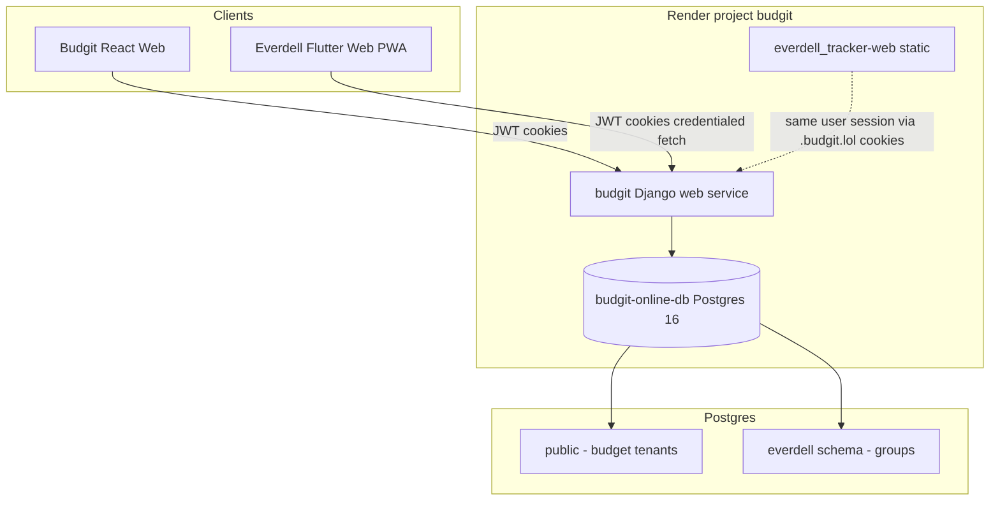

> **Source of truth:** budgit `docs/BUDGIT_EVERDELL_INTEGRATION_PLAN.md` @ `main` commit `e26e15b` (or later).  
> Re-copy when phases or architecture change.

# Budgit + Everdell Tracker — Integration Plan

> **Status:** Living document — updated June 2026 after Phase 0 + Phase 1 API (Budgit).  
> **API contract (authoritative for endpoints):** `docs/EVERDELL_PHASE1_API.md`, `docs/EVERDELL_PLAYER_ACCOUNTS.md`  
> **Everdell Flutter repo:** `everdell_tracker` — client UI; Budgit owns auth, API, DB, deploy orchestration.

---

## Executive summary (current)

- Users log into **https://www.budgit.lol**, open **Everdell Tracker** from the Budgit menu at **https://everdell.budgit.lol**.
- Scorebooks are scoped by **Everdell group**, not Budgit budget tenant — John (tenant A) and Julia (tenant B or no tenant) can share a group.
- **Budgit backend:** Django app `everdell`, PostgreSQL schema `everdell`, routes under `/api/everdell/`.
- **Phase 0 + Phase 1 API:** ✅ shipped on `main` (groups, games, players, linking, nicknames, display prefs, `/api/everdell/me/`).
- **Phase 2 (Flutter):** 🔲 not started — `everdell_tracker` still uses local storage; wire to API next.
- **Server is source of truth** for online mode (v1): fetch on open, write-through on save; 409 on stale game updates.

---

## Architecture (as deployed)



| Layer | Budgit budget | Everdell Tracker |
|-------|---------------|------------------|
| Auth identity | `accounts.CustomUser` | Same user |
| Authorization | `tenant_id`, tenant membership | `group_id`, `EverdellGroupMember` |
| Data scope | Per tenant | Per Everdell group |
| Client | React (`frontend/`) | Flutter (`everdell_tracker`) |

**Critical rule (implemented):** Everdell handlers never authorise with `tenant_id` alone. Flow: authenticated user → member of `group_id` → query that group. Non-members get **404**.

---

## Hosting (decision locked)

| Piece | URL | Render service |
|-------|-----|----------------|
| Budgit + API | `budgit.lol`, **`www.budgit.lol`** | `budgit` (Django) |
| Everdell UI | `everdell.budgit.lol` | `everdell_tracker-web` (static) |
| Database | — | `budgit-online-db` (single Postgres) |

**Option A (subdomain)** was chosen. See [Superseded: hosting options](#superseded-hosting-options) for Options B/C reasoning.

**Cross-origin API:** Flutter and POC pages must call **`https://www.budgit.lol`** (apex redirects without CORS). Auth cookies use domain **`.budgit.lol`** (`accounts/cookie_utils.py`, `settings_prod.py`).

**Migrations on deploy:** `render_start.sh` runs `migrate_schemas --shared` then `--tenant` before Gunicorn.

---

## Security model (implementation status)

| Item | Status |
|------|--------|
| `everdell` schema separate from budget tables | ✅ |
| Group membership check on every group-scoped route | ✅ (`everdell/services.py`) |
| 404 for non-members (not 403) | ✅ |
| `created_by` / `updated_by` / `updated_at` on games | ✅ |
| CORS + CSRF for `everdell.budgit.lol` | ✅ |
| JWT in `access_token` / `refresh_token` cookies | ✅ (`CookieJWTAuthentication`) |
| Rate-limit group create/join | 🔲 not implemented |
| No budget data in Everdell list endpoints | ✅ |

**Intentional cross-tenant sharing:** Budgit tenant isolation applies to **budget** only. Everdell is **group-scoped**. Same user in two groups sees two scorebooks.

---

## Data model (as implemented)

Schema: **`everdell`** (Django app `everdell`, `Meta.db_table = 'everdell.*'`).

### `everdell.groups` — ✅

`EverdellGroup`: `id`, `name`, `invite_code`, `created_by`, `created_at`, `updated_at`.

### `everdell.group_members` — ✅

`EverdellGroupMember`: `group`, `user`, `role` (`owner`/`member`), `joined_at`. Unique `(group, user)`.

### `everdell.players` — ✅ (expanded beyond original plan)

`EverdellPlayer`:

| Field | Notes |
|-------|------|
| `id` | UUID PK — **global** roster identity |
| `group_id` | FK |
| `name` | Sheet/roster name |
| `nickname` | Defaults to `name`; group-local display |
| `avatar` | Optional image (group-local) |
| `user_id` | Optional FK → Budgit account (linked player) |
| `display_name_source` | `player` or `user` (linked only) |
| `display_avatar_source` | `player` or `user` (linked only) |
| Profile fields | `email`, `phone`, `date_of_birth`, `first_played_at`, `is_board_gamer`, `profile_extra` |

**Constraints:** At most **one linked player per user per group** (`everdell_player_one_user_per_group`). Duplicate names in a group allowed (different UUIDs).

**Resolved API fields:** `display_name`, `display_avatar_url` (see `EVERDELL_PLAYER_ACCOUNTS.md`).

### `everdell.games` — ✅

`EverdellGame`: `id`, `group_id`, `played_at`, `notes`, `expansion_flags`, `payload` (JSON), `created_by`, `updated_by`, `created_at`, `updated_at`.

`payload` mirrors Everdell `Game.toJson()` from `everdell_tracker`.

### `accounts.CustomUser` (Everdell-facing) — ✅

- `display_name` — Everdell account display name (`everdell_profile_name()` fallback chain)
- `profile_picture` — account avatar (existing field)

### `everdell.user_preferences` — 🔲 not implemented

> **Superseded plan:** Table for `last_active_group_id` + settings JSON. Deferred to Phase 2/3 Flutter (can use local storage for last group until API exists).

---

## API (as implemented)

**Base path:** `/api/everdell/`  
**Auth:** `CookieJWTAuthentication` (browser: `POST /api/token/cookie/` sets cookies) or Bearer JWT.  
**Detail:** `docs/EVERDELL_PHASE1_API.md`, `docs/EVERDELL_PLAYER_ACCOUNTS.md`

### Groups — ✅ Phase 0

| Method | Path |
|--------|------|
| GET/POST | `/api/everdell/groups/` |
| POST | `/api/everdell/groups/join/` |
| GET | `/api/everdell/groups/<uuid>/` |

### Account profile — ✅

| Method | Path |
|--------|------|
| GET/PATCH | `/api/everdell/me/` |

### Players — ✅ Phase 1 + profiles

| Method | Path |
|--------|------|
| GET | `/api/everdell/players/mine/` |
| GET/POST | `/api/everdell/groups/<group_id>/players/` |
| GET/PATCH | `/api/everdell/groups/<group_id>/players/<player_id>/` |
| POST | `/api/everdell/groups/<group_id>/players/<player_id>/link/` |

### Games — ✅ Phase 1

| Method | Path |
|--------|------|
| GET/POST | `/api/everdell/groups/<group_id>/games/` |
| GET/PUT/DELETE | `/api/everdell/groups/<group_id>/games/<game_id>/` |

PUT requires matching `updated_at` → **409** with `current` body if stale.

### Not implemented (original plan — deferred)

| Planned | Status |
|---------|--------|
| `POST /groups/:id/invite/rotate` | 🔲 |
| `GET/PUT /preferences` | 🔲 |
| `GET /games/mine/` (filter by linked player UUIDs in payload) | 🔲 Phase 2+ |

---

## Phase delivery (actual progress)

### Phase 0 — ✅ Complete (production verified)

- [x] `everdell` schema + groups + group_members
- [x] Groups API + invite join
- [x] Shared cookies `.budgit.lol`, CORS/CSRF
- [x] Budgit nav link → `everdell.budgit.lol`
- [x] Cross-subdomain POC (`docs/everdell-cross-origin-poc.html`)
- [x] Two-user group test

**Testing:** `docs/EVERDELL_PHASE0_TESTING.md`

### Phase 1 — ✅ Complete (Budgit API; local + prod smoke)

- [x] Games + players CRUD
- [x] 409 optimistic concurrency on games
- [x] Player UUID identity, optional account link
- [x] Nicknames, avatars, per-group display name/avatar source
- [x] `/api/everdell/me/`, `/api/everdell/players/mine/`
- [x] Tests in `everdell/tests.py`
- [x] Migrations through `everdell.0004`, `accounts.0004`

**Testing:** `docs/EVERDELL_PHASE1_SMOKE.md`

### Phase 2 — 🔲 Next (`everdell_tracker` repo)

- [ ] Login gate (redirect to Budgit login if no `access_token`)
- [ ] `EverdellApiService` → `https://www.budgit.lol`
- [ ] Group picker / switcher
- [ ] Replace local game storage for online mode
- [ ] Roster UI: use `display_name`, `display_avatar_url`; store player UUIDs in game payload
- [ ] Handle 409 on game save

**Flutter references:** `lib/services/platform_storage_service.dart`, `lib/services/data_export_service.dart`, `lib/models/game.dart`

### Phase 3 — 🔲 Polish (both repos)

- [ ] Group management UI on Budgit (optional)
- [ ] Import legacy local JSON into a group
- [ ] `user_preferences` API + last active group
- [ ] Persistent avatar storage on Render (disk/S3 — uploads work but may not survive redeploy without config)
- [ ] `GET /api/everdell/games/mine/`

---

## Budgit frontend (React)

| Item | Status |
|------|--------|
| Nav link Everdell Tracker | ✅ `Navigation.js`, `MobileHeader.js` |
| Manage Everdell groups UI | 🔲 deferred |
| Login `returnUrl` for Everdell | 🔲 Phase 2 Flutter concern first |

---

## Flutter client (`everdell_tracker`) — current state

- Version ~2.3.x; scoring + visual card selection — **local only** (`PlatformStorageService`).
- Deployed: `everdell.budgit.lol` static site.
- **No Budgit API integration yet** — Phase 2 work.

### Planned `EverdellApiService` (sketch)

```
EverdellApiService (base: https://www.budgit.lol)
  ├── getMe() / patchMe()
  ├── listGroups() / createGroup() / joinGroup()
  ├── listPlayers(groupId) / createPlayer() / patchPlayer()
  ├── listMyPlayers()
  ├── listGames(groupId) / getGame() / createGame() / updateGame() / deleteGame()
  └── on409 → show refresh message
```

---

## Auth contract for Flutter (implemented on Budgit)

1. **Web PWA:** `fetch(url, { credentials: 'include' })` to `https://www.budgit.lol`.
2. **Login:** User logs in on Budgit (or `POST /api/token/cookie/`); cookies `access_token`, `refresh_token` on `.budgit.lol`.
3. **DRF browsable API / local dev:** Admin login is **not** enough — use `/api/token/cookie/` POST first.
4. **Bearer:** Standard JWT `Authorization` header also supported.

---

## Deploy checklist (each Budgit release)

```text
[ ] Render logs: migrate_schemas --shared and --tenant succeeded
[ ] New everdell/accounts migrations applied (if any)
[ ] Budgit smoke: login, budget pages
[ ] Everdell smoke: docs/EVERDELL_PHASE1_SMOKE.md
[ ] everdell_tracker static redeploy only if Flutter changed
```

---

## Known gaps / follow-ups

| Topic | Notes |
|-------|--------|
| Avatar file persistence on Render | API accepts uploads; configure MEDIA storage for production durability |
| `www` vs apex | API clients must use `www.budgit.lol` for credentialed cross-origin |
| Multi-root Cursor workspace | See handoff notes when working across repos |
| `BUDGIT_AGENT_HANDOFF.md` | Budgit-specific agent notes; Phase 0/1 complete |

---

## Superseded sections (historical reasoning)

<a id="superseded-hosting-options"></a>

### Superseded: hosting options debate

**Original question:** Subdomain vs path vs separate onrender URL.

| Option | Verdict |
|--------|---------|
| **A — Subdomain** (`everdell.budgit.lol`) | **Chosen** — simple Flutter `base-href`, isolated static deploy |
| **B — Path** (`budgit.lol/everdell/`) | Superseded — more SPA routing friction |
| **C — onrender.com URL** | Superseded — used only for earliest POC; replaced by custom domain |

### Superseded: minimal player model

Original plan: `players(id, group_id, name, created_at)` only.

**Superseded by:** Full roster identity (UUID), optional `user` link, nickname, avatar, display source prefs, profile fields. See `EVERDELL_PLAYER_ACCOUNTS.md`.

### Superseded: “Phase 0 before any games API”

Phase 0 gating was correct for de-risking auth/cookies. Phase 1 API is now complete; Flutter integration no longer blocked on Budgit.

### Superseded: open questions table

| Question | Answer (filled in) |
|----------|-------------------|
| Backend stack | Django 5 + DRF + django-tenants |
| Migrations | Django migrations; `migrate_schemas` for shared + tenants |
| Auth | JWT in HttpOnly cookies + Bearer |
| Render services | `budgit`, `everdell_tracker-web`, `budgit-online-db` |
| Users table | `accounts.CustomUser` in public schema |

### Superseded: npm migrate hook

Plan suggested `npm run migrate` — **not applicable**. Budgit uses `render_start.sh` with `manage.py migrate_schemas`.

---

## Related documentation map

| Doc | Purpose | Audience |
|-----|---------|----------|
| `EVERDELL_PHASE1_API.md` | Endpoint contract | Flutter agent |
| `EVERDELL_PLAYER_ACCOUNTS.md` | Players, linking, display | Flutter agent |
| `EVERDELL_PHASE0_TESTING.md` | Two-user + local API | Budgit dev |
| `EVERDELL_PHASE1_SMOKE.md` | Prod smoke checklist | You |
| `everdell-cross-origin-poc.html` | Cookie POC | Either repo (copy to static) |

**Copy to `everdell_tracker`:** Phase 1 API + Player Accounts (+ optional smoke). Mark source-of-truth line — see multi-repo setup below.

---

## Related Everdell repo references

| Topic | Location in `everdell_tracker` |
|-------|-------------------------------|
| Game model | `lib/models/game.dart` |
| Export JSON shape | `lib/services/data_export_service.dart` |
| Local storage | `lib/services/platform_storage_service.dart` |
| Web deploy | `render.yaml`, `WEB_DEPLOYMENT.md` |

---

## Suggested agent prompts (June 2026)

**Budgit (maintenance only):**

> Read `docs/BUDGIT_EVERDELL_INTEGRATION_PLAN.md` and `docs/EVERDELL_PHASE1_API.md`. Phase 0/1 API is complete. Only change Everdell API for bugs or Phase 3 items.

**Flutter (`everdell_tracker`) — Phase 2:**

> Implement Phase 2 per `docs/BUDGIT_EVERDELL_INTEGRATION_PLAN.md`. API contract: copied `docs/budgit-api/EVERDELL_PHASE1_API.md` and `EVERDELL_PLAYER_ACCOUNTS.md` (source: budgit repo `main`). Base URL `https://www.budgit.lol`, credentials include. Use `display_name` in roster UI.

---

*Document version: 2.0 — Phase 0 + Phase 1 API complete; Phase 2 Flutter next.*

